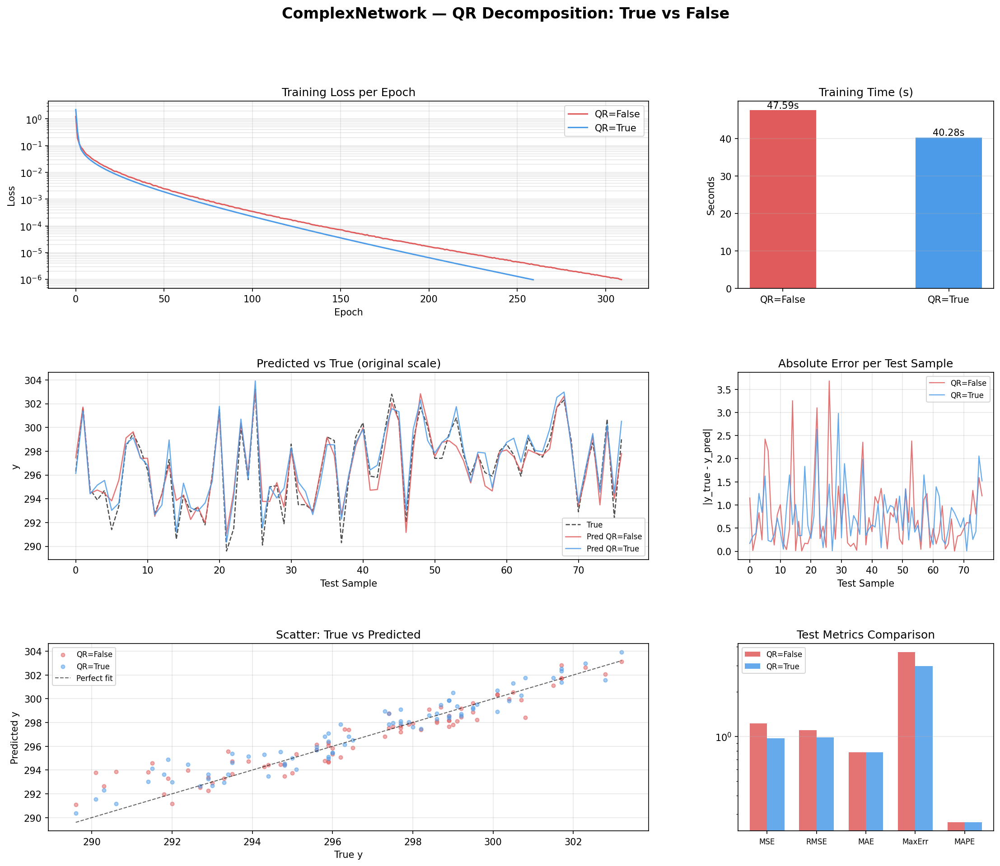
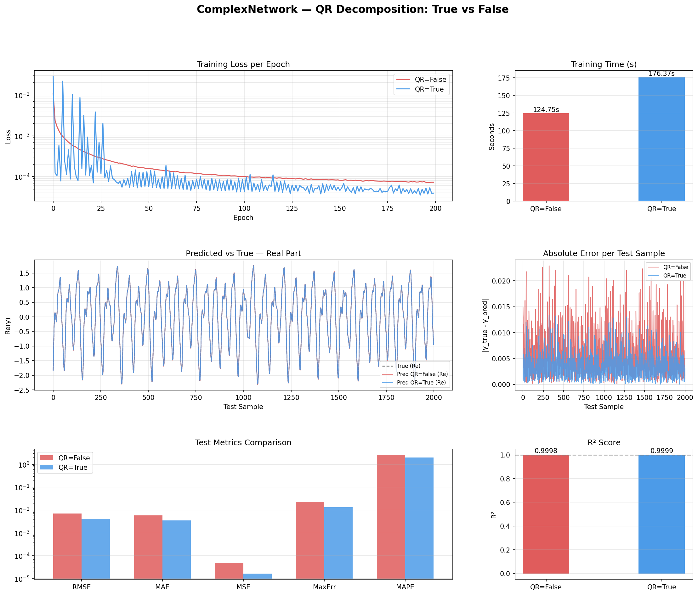
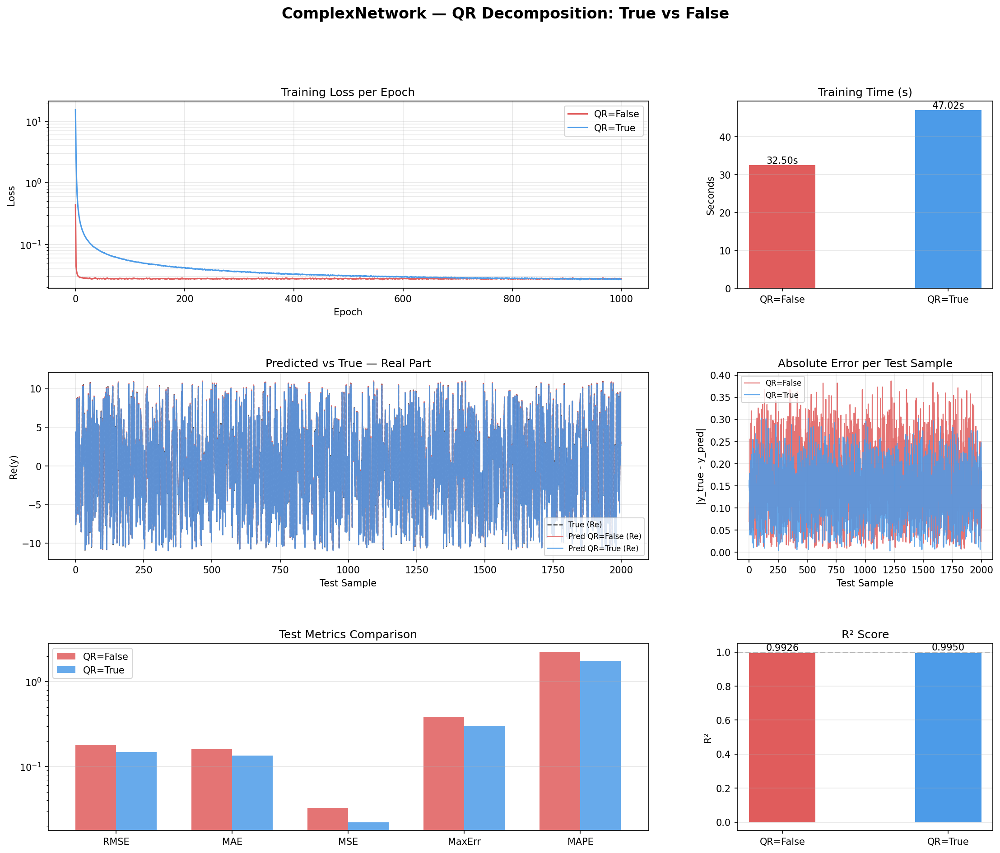

# Introduzione
La CVNN (Complex-Valued Neural Network) in esame supporta due modalità di addestramento:
•	Backpropagation Standard (QR=False): aggiornamento iterativo campione per campione tramite gradiente stocastico. 

•	Decomposizione QR Batch (QR=True): i pesi del layer di output vengono aggiornati a fine apoca risolvendo un sistema tramite fattorizzazione QR, mentre i layer nascosti usano comunque la backpropagation iterativa.
# Struttura
La rete riceve valori complessi nel layer di input.
I layer nascosti hanno in output la funzione di attivazione:
math
$$ f(z) = \tanh(Re(z))+ j\tanh(Im(z))$$
Ciascun neurone dei layer nascosti hanno i pesi impostati inizialmente con la
Inizializzazione Xavier:
$$ \sigma = \sqrt{\frac{2}{n_{input} + n_{output}}}$$
In questo modo ogni componente reale e immaginaria è estratta in maniera indipendente da
$N(0, \sigma^2)$, garantendo la stabilità della varianza durante le prime fasi di training

Il layer di output utilizza una funzione di attivazione lineare.

# Training
## FeedForward 
Consiste nel propagare in avanti un campione di input attraverso i layer in sequenza.
Per ogni layer, gli output del layer precedente diventano gli input del layer corrente. 
Il risultato finale è la lista di output complessi del layer di uscita.
Nel caso in cui venga applicata la Decomposizione QR, è necessario salvare la lista degli output di ciascun layer
per creare la matrice A, e per ciascun neurone l'uscita pre-attivazione, quindi la combinazione lineare dei pesi.

## Backpropagation "Standard"
1.	Forward: calcolo degli output di ogni layer e salvataggio di last_z e last_output.
2.	Calcolo delta output: $δₖ = Dₖ − Yₖ$ (target meno output dopo attivazione lineare).
3.	Aggiornamento pesi output: $Δw = η · δ$ per bias; $Δwᵢ = η · δ · xᵢ^*$ per i pesi.
4.	Backprop layer nascosti: propagazione del delta ponderato e aggiornamento pesi con la derivata della split-tanh.
    $$ f'(z) = (1 − \tanh^2(Re(z))) +  j(1 − \tanh^2(Im(z)))$$ 

## Decomposizione QR
Nella modalità QR, il layer di output non viene aggiornato campione per campione ma una sola volta per epoca.

1. Viene popolata la matrice A $M \times (N+1)$ (M sono i camponi, N numero dei neuroni del penultimo layer)
2. Successivamente deve essere risolto il sistema $A · ΔW \sim δ$  con la fattorizzazione $A=QR$
3. Si minimizza $||\delta -A \Delta W||^2$
4. Si aggiornano i pesi $ w \leftarrow w + \Delta W$
5. 
# Esperimenti
## Dataset dati satellitari - Predizione della temperatura

## Serie Caotica Mackey-Glass

## Dataset complesso con funzione lineare

# Conclusione
Secondo questi risultati la Decomposizione QR è vantaggiosa quando il dataset è grande e la funzione target è non-lineare e complessa. 
Perde il vantaggio su funzioni lineari su reti piccole.
I tempi più alti sono dati dal fatto che c'è da risolvere un sistema con matrici molto grandi